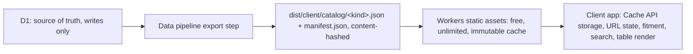

# Browser-Resident Catalog Feasibility (2026-09-10)

Question: can the immutable catalog live in the user's browser (download once,
filter/search/fitment locally), so the site runs on Cloudflare Free without
D1 hot-path reads? This note records measured repo facts and external limits,
then recommends an architecture.

## Measured facts (local D1, current data)

| Fact | Value |
|---|---|
| Total catalog rows (all 7 kinds) | 8,456 (gpus 5,033; cases 1,118; motherboards 1,014; fans 437; cpu-coolers 400; psus 258; ram 196) |
| Decoded `build-parts` payload (cases + gpus JSON) | 3.94 MB |
| Full search corpus (`display_name` + `normalized_search_text`, all kinds) | ~465 KB |
| D1 database storage (dashboard) | 122.54 MB |

The 122.54 MB D1 figure is storage overhead (pages, indexes, per-kind tables),
not logical payload size. The entire logical catalog is roughly 5–7 MB of JSON
(~1.5–2 MB compressed). **A browser-resident catalog is a small-file problem,
not a large-file problem.**

## External limits (primary sources)

- Workers Free: 100k Worker requests/day, 10 ms CPU/invocation. **Static asset
  requests are free and unlimited** and do not invoke the Worker
  (developers.cloudflare.com/workers/static-assets/billing-and-limitations/).
- Static assets: 25 MiB per file, 20k files per version — a ~2 MB compressed
  catalog fits in one file per kind.
- Browser storage quotas (MDN Storage quotas): Chrome ~60% of disk; Safari 17+
  ~60% (browser app); Firefox min(10% disk, 10 GiB). All APIs (Cache/IDB/OPFS)
  share one per-origin pool; a 2–7 MB catalog is trivially inside every quota.
- Eviction: whole-origin LRU under storage pressure; Safari deletes
  script-writable storage after 7 days without user interaction
  (webkit.org/blog/10218/). Consequence: periodic ~2 MB re-download, not a
  blocker. `navigator.storage.persist()` reduces eviction risk.

## What already exists in this repo

- `parseBuildQuery` / `buildUrl` (`src/lib/build-state.ts`) — pure TS URL
  state contract; runs unchanged in the browser.
- `src/fitment/engine.ts` — pure TS, UI-agnostic, fully tested.
- `InMemoryCatalogStore` (`src/server/in-memory-catalog-store.ts`) — proves
  the view layer is store-agnostic.
- `fuseSearchRows` (`src/server/catalog-search.ts`) + `fuse.js` dependency —
  client-style ranked search already implemented and tested.

The only piece that cannot run in the browser today is the Astro SSR table
markup in `build.astro` / `build-view.ts` row rendering, and the D1-backed
`D1CatalogStore`.

## Recommended architecture

1. **Data pipeline** (`npm run intake:sql` stage): after seeding D1, export
   per-kind JSON + a `manifest.json` (version, per-kind hash, row counts) into
   `dist/client/catalog/`. Immutable, content-hashed URLs.
2. **Client**: `/build` becomes a static shell + island. On load: read cached
   manifest → fetch only changed kind files → store in Cache API → hydrate the
   same view logic client-side. All filters, fitment, pagination, and search
   run locally against the cached records.
3. **Search/autocomplete**: reuse `fuseSearchRows`/normalized substring logic
   client-side over the ~465 KB corpus. Sub-millisecond for 8.5k rows; no
   FTS5, no OPFS, no sqlite-wasm needed at this scale.
4. **D1**: stays as the write-side source of truth and deployment pipeline
   dependency only. No public hot-path reads. The current D1-backed SSR routes
   can remain during migration as the no-JS/fallback path, then be retired.

## Why this also fixes the request quota

Static asset requests are free and unlimited and never invoke the Worker, so
a client-rendered `/build` removes both the D1 rows-read ceiling **and** the
100k/day Worker request ceiling for ordinary browsing. The current SSR
architecture burns one Worker invocation per `/build` view.

## Costs and risks

- **Porting the table render to client-side** is the main engineering cost
  (`build.astro` markup + `build-view.ts` view assembly move into an island).
  The pure logic (state, filters, fitment, sorting) ports as-is.
- **SEO/no-JS**: `/build` is a tool surface, not content; the product docs
  already frame it as a filterable data table driven by URL state. A static
  fallback page can state "JavaScript required".
- **Stale clients**: users see the catalog version they cached until the
  manifest changes; the 7-day Safari eviction only forces a re-download.
- **First-visit cost**: one ~2 MB compressed download; subsequent visits hit
  the browser cache (and Cloudflare's edge cache).
- **Policy change**: the D1-read-budget rule in AGENTS.md ("route high-volume
  catalog reads through CATALOG_CACHE KV", "query that FTS index") is replaced
  by: catalog reads for `/build` come from published static artifacts; D1 is
  pipeline-only. This needs an ADR when implemented.

## Alternatives considered

- **sqlite-wasm + OPFS + FTS5 trigram artifact**: viable and documented
  (SQLite WASM ships FTS5; `importDb` streams chunks into OPFS), but it is
  complexity for a scale problem we do not have — the whole corpus is under
  7 MB. Revisit only if the catalog grows 50×.
- **R2 artifact hosting**: free 10 GB-month + 10M Class B ops/month, but
  Workers static assets are strictly cheaper (unlimited free requests) and
  already part of the deploy.
- **Keep D1 + KV + rate limiting (current state)**: contains the problem but
  leaves the 100k/day Worker request ceiling and the 5M rows/day cliff.

## Verdict

Feasible with modest complexity because the real payload is ~2 MB compressed,
not 123 MB. Recommended target architecture for staying on Free.
