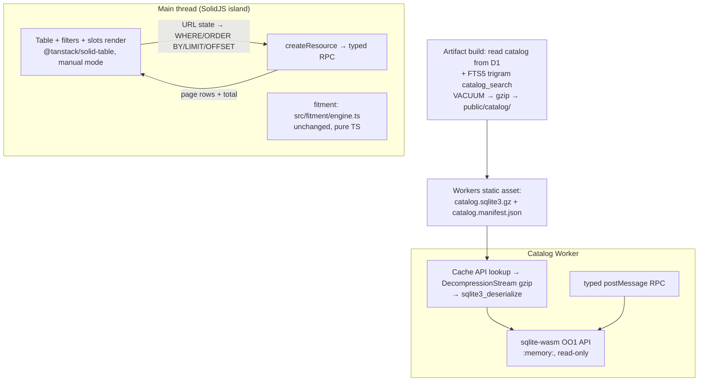

# Client-Side Database Selection (2026-09-10)

Decision note. Supersedes the "no DB needed" verdict in
`browser-resident-catalog-feasibility-20260910.md`: the user chose a real
browser-resident database for the client-side catalog. Stack direction is
SolidJS + TanStack Table; this note selects the database layer.

## Candidates surveyed (primary sources)

| Candidate | What it is | Verdict for this project |
|---|---|---|
| **@sqlite.org/sqlite-wasm** | Official SQLite WASM as an ESM npm package. Apache-2.0, ~463K weekly downloads, maintained by the SQLite WASM maintainer (sgbeal) with no changes to upstream SQLite beyond TS types. | **Selected.** Only candidate that is upstream SQLite itself: FTS5 is in the canonical build, `opfs-sahpool` VFS needs no COOP/COEP, `importDb()` streams a downloaded DB into OPFS. Ships Vite/webpack/rsbuild/parcel sahpool demos + bundler-compatibility tests. |
| wa-sqlite (rhashimoto) | WASM SQLite with JS-implemented VFS layer; multiple backends (IndexedDB, OPFS variants), sync + Asyncify/JSPI builds. MIT, 1.4k stars. | Strong runner-up. More VFS options and true multi-connection OPFS, but the API is a lower-level C wrapper, and **FTS5 in their prebuilt dist is not documented** — needs verification. Choose only if we need a VFS sahpool can't provide. |
| sql.js-httpvfs (phiresky) | Read-only SQLite over HTTP Range requests against a statically hosted .sqlite3 file; downloads only touched pages. | Wrong scale fit. Designed for huge immutable datasets; a ~5–10 MB catalog is cheaper to download once. Also effectively low-maintenance, with a reported Cloudflare-hosting `HEAD`/`Content-Length` issue. |
| absurd-sql | IndexedDB-as-disk persistence for sql.js. | Legacy. Effectively unmaintained; sql.js core is in-memory only. |
| sql.js | SQLite WASM, in-memory, no persistence. | Non-starter: all data lost on reload. |
| RxDB / PouchDB / Dexie / LokiJS | Document/replication-oriented client DBs. | Wrong model. We need immutable relational data + SQL filtering + FTS trigram substring search, no writes, no sync, no conflict handling. RxDB additionally gates features behind paid plugins. |
| cr-sqlite (vlcn) | CRDT SQLite for multi-writer sync. | Writes/sync we don't have. |

## Decision

**@sqlite.org/sqlite-wasm, deserialized into an in-memory database in one
dedicated Web Worker. The compressed artifact is cached in the Cache API.**

Revised 2026-09-16: the original decision below used the `opfs-sahpool` VFS.
That was replaced after reproducing a hard multi-tab failure — a SAH pool
permits only one open access handle per directory, so the second tab to load
`/build` failed with `NoModificationAllowedError` on `createSyncAccessHandle`,
and its recovery path (`removeVfs`) failed too, leaving that tab on the error
state. The Cache API has no such exclusivity, so every tab loads independently.

Key technical points, all verified against primary docs or the shipped build:

- Storage is the **Cache API**, keyed by catalog version. It is shared safely
  by concurrent tabs and persists across reloads; a reload re-reads the ~1.5 MB
  artifact locally and makes no artifact network request.
- The worker deserializes the artifact with `sqlite3_deserialize` into an
  in-memory database (`:memory:`, `pragma query_only = on`). No COOP/COEP
  headers are needed, because no OPFS VFS is involved.
- The database is ~21 MB expanded per tab. That is the accepted cost of
  dropping the single-writer VFS; the data is read-only and never written.
- FTS5 ships in the canonical build (maintainer statement on the SQLite forum;
  build is `--enable-all`). The **trigram tokenizer** gives indexed arbitrary
  substring matching — same semantics as the D1 FTS autocomplete. Verified
  end-to-end against the real artifact: the trigram index survives
  `sqlite3_deserialize` and answers `catalog_search MATCH` queries.
- Decompress with `DecompressionStream('gzip')`: gzip is implemented
  everywhere; **brotli is NOT implemented in Chrome's DecompressionStream**.
  So the artifact ships as `.gz`, decompressed in the worker before deserialize.

## Architecture

Note: `src/components/build/catalog.worker.ts` currently calls `getBuildView`
directly rather than the `createResource`/TanStack split drawn above; TanStack
Table is a dependency but the table renders from `BuildView` rows.

### Reuse this repo already has

- `buildCatalogSearchStatement` (`src/server/catalog-search-query.ts`) — the
  exact FTS5 MATCH SQL, extracted earlier for the D1 budget tests. Running the
  identical statement client-side **guarantees autocomplete parity** and keeps
  `EXPLAIN QUERY PLAN` verifiable.
- `decodeCatalogRow` + `SELECT * FROM <kind>` (`src/server/d1-decoders.ts`) —
  pure TS row decoders work unchanged on worker query results.
- `.data/intake-seed.sql` — the intake pipeline already emits full INSERT
  statements; the artifact build replays them into a fresh SQLite file and
  adds the FTS5 DDL from `migrations/0008_catalog_search_fts.sql`.
- `src/fitment/engine.ts`, `src/lib/build-state.ts` — run in the island as-is.

### Update & lifecycle model

- Boot: fetch the tiny `catalog.manifest.json` (no-store) for the version, then
  look up the compressed artifact in the Cache API under
  `/catalog/catalog.sqlite3.gz?v=<version>`. Cache hit → no artifact network
  request; miss → download, cache, and log `downloaded` in the status line.
- A version change is a cache miss by construction (the key includes the
  version), so a new catalog is fetched and the superseded entry is deleted on
  write. No partial states: the database only becomes active after a successful
  `sqlite3_deserialize` and row-count check.
- Eviction (Safari 7-day rule, storage pressure): manifest says version X, no
  cache entry → re-download ~1.5 MB.
- Cache API unavailable (private mode, quota): the catch falls through to a
  direct network fetch per load; the catalog still works, just uncached.

### TanStack Table integration

`@tanstack/solid-table` in **manual pagination + manual sorting** mode: URL
state (search, filters, sort, page) is translated to
`WHERE … ORDER BY … LIMIT/OFFSET` SQL; the worker returns one page of decoded
`PartRecord`s plus `COUNT(*)` for pagination math. TanStack manages columns,
sort state, and row model; Solid `createResource` suspends per query. The
fitment engine evaluates the returned page; verdict highlighting stays client
TS as today.

## Risks

1. **Trigram index size** — measured: the artifact is 21.6 MB raw, 1.5 MB
   gzipped, of which `catalog_search` (trigram FTS5) is ~2.9 MB and
   `catalog_records` ~17.4 MB. Well inside Workers static-asset limits.
2. **Vite/worker bundling friction** — one accommodation was required, and it
   is in `astro.config.mjs`: `optimizeDeps.exclude: ["@sqlite.org/sqlite-wasm"]`
   keeps the wasm package out of Vite's dependency pre-bundling. That is a
   dev-server concern; the `astro build` output bundles the worker and wasm
   through the normal pipeline.
3. **Multi-tab** — resolved by dropping the single-writer OPFS VFS; see the
   revision note above. Verified: two tabs loading `/build` simultaneously both
   render the catalog.
4. **Per-tab memory** — each tab expands the ~21 MB database into wasm memory.
5. **First-load weight** — one-time ~1.5 MB gzip download per catalog version.

## Sources

- https://github.com/sqlite/sqlite-wasm (official npm wrapper; Vite config, sahpool demos)
- https://www.npmjs.com/package/@sqlite.org/sqlite-wasm (463K weekly downloads, Apache-2.0)
- https://sqlite.org/wasm/doc/trunk/persistence.md (sahpool vs opfs VFS, COOP/COEP, importDb, locking)
- https://sqlite.org/wasm/doc/trunk/api-oo1.md (OO1 API used by the worker)
- https://sqlite.org/wasm/doc/trunk/api-c-style.md#sqlite3_deserialize (deserialize path used instead of an OPFS VFS)
- https://developer.mozilla.org/en-US/docs/Web/API/Cache (Cache API shared by concurrent tabs)
- https://www.sqlite.org/fts5.html (trigram tokenizer, substring matching)
- https://github.com/rhashimoto/wa-sqlite (runner-up; VFS comparison, MIT)
- https://github.com/phiresky/sql.js-httpvfs (range-request static SQLite)
- https://rxdb.info/alternatives.html (landscape: sql.js no persistence, absurd-sql legacy, Dexie/PouchDB document-model)
- https://developer.mozilla.org/en-US/docs/Web/API/Storage_API/Storage_quotas_and_eviction_criteria (quotas, eviction, Safari 7-day via webkit.org/blog/10218/)
